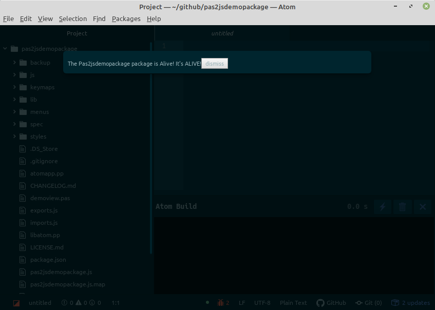

# pas2jsdemopackage package

This package is a small adaptation of a Atom Package example.




To install it, compile the program and then make a symlink to this directory from the atom
packages dir:
```sh
cd ~
cd .atom/packages
ln -s ~/pas2js/demo/atom pas2jsdemopackage
```
Then restart atom and you should have a 'pas2jsdemopackage' item under the
'packages' menu.

